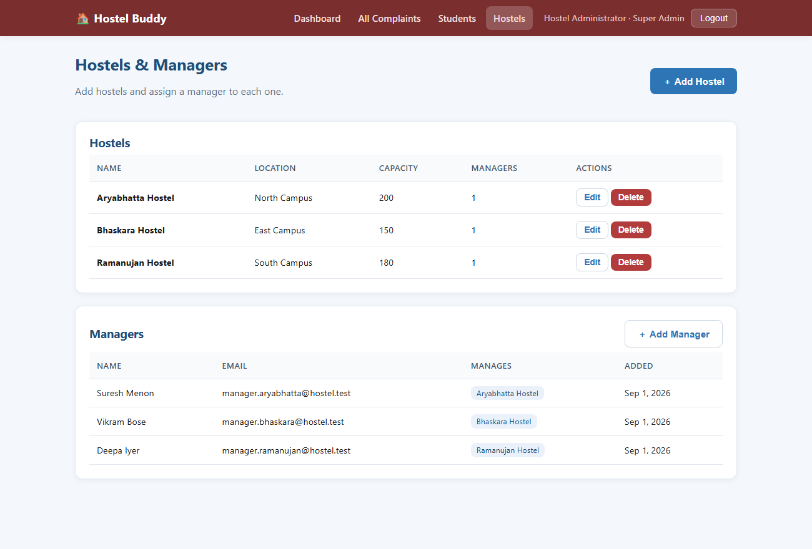
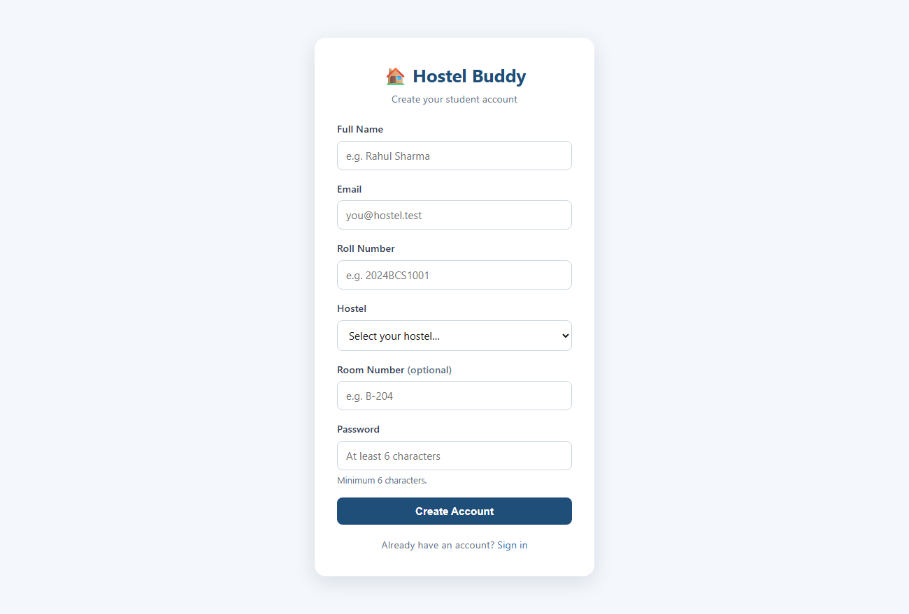
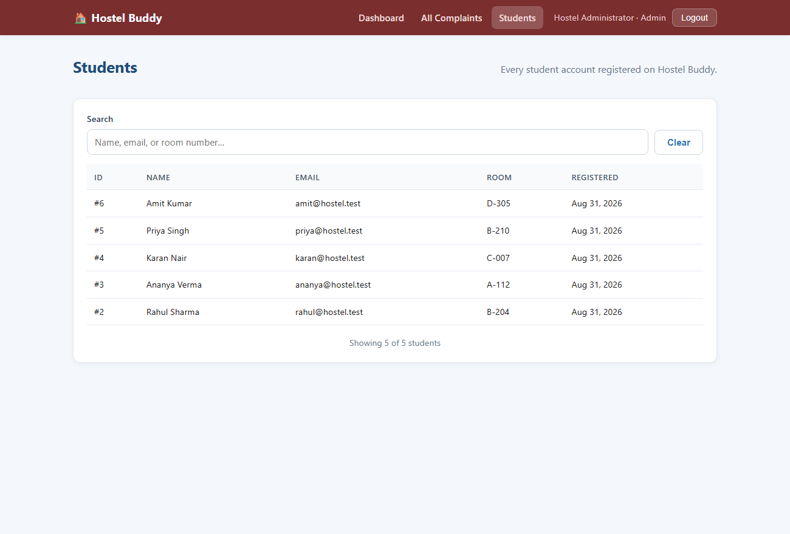
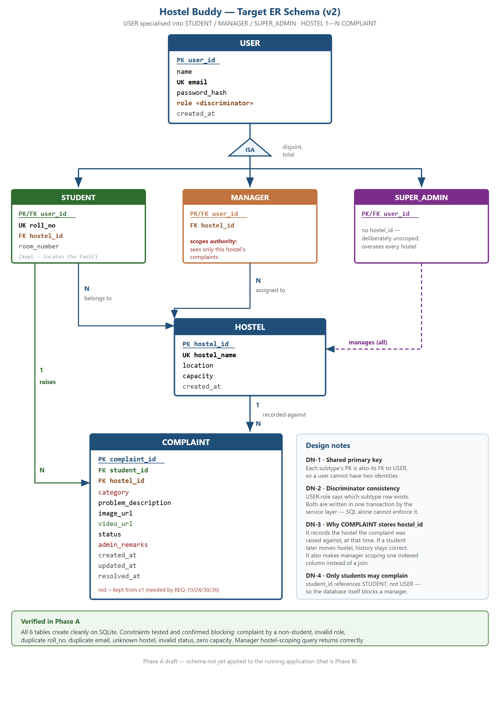

# 🏠 Hostel Buddy

[](https://github.com/Pranjaltyagi76/Hostel-Buddy-College-Semester-5-Project/actions/workflows/tests.yml)
[](https://nodejs.org)
[](#-testing)
[](#-license)

**A Smart Hostel Complaint Management System.** Students raise and track maintenance complaints online; each hostel's manager works the queue for their own hostel; a super admin oversees every hostel. It replaces the paper complaint register with something searchable, trackable and answerable.

> Built as a **model working version** — realistic end-to-end functionality on a clean layered architecture, without the scope of a full production system.

**What makes it more than a CRUD app:**

- A **three-role ISA model** — `USER` specialised into `STUDENT`, `MANAGER` and `SUPER_ADMIN`, with the subtype's primary key doubling as its foreign key.
- **Hostel scoping as a real authorization boundary.** A manager cannot read, search or modify another hostel's complaint, and the scope is resolved from the caller's own database row — never from the request. It has its own tests, in both directions.
- **Attachments verified by their bytes**, not their declared type — including a video allowlist narrow enough that anything stored is guaranteed playable.
- **265 API integration checks**, including a regression suite that pins down every bug found in the code audit.

---

## 📸 Screenshots

| Super admin dashboard (analytics) | Student — My Complaints |
|---|---|
|  |  |

| All Complaints (search · filter · scope) | Hostels & managers (super admin only) |
|---|---|
|  |  |

<details>
<summary>More screenshots — landing, login, register, student dashboard, raise a complaint, students list</summary>

| | |
|---|---|
|  |  |
|  |  |
|  |  |

</details>

Regenerate them any time with `node docs/screenshots-source/capture.js` (headless Chrome over CDP — no extra dependencies).

---

## ✨ What each role can do

**Student**
- Register with a roll number and the hostel they live in, then log in and manage a profile
- Raise a complaint — pick a category, describe the issue, optionally attach **a photo and a video**
- Track status in real time: **Pending → In Progress → Resolved → Closed**
- Read the manager's remarks and the resolution date
- Edit or delete a complaint while it is still Pending — and only then
- Personal dashboard with their own complaint statistics

**Hostel manager**
- The complaint queue for **their own hostel** — searching, filtering and paginating it, with the students list and every dashboard figure narrowed the same way
- Advance a complaint's status and leave remarks for the student
- Provisioned by a super admin; there is no public sign-up for this role

**Super admin**
- The same views, **unscoped** — every complaint in every hostel, plus a per-hostel breakdown
- Create, rename and remove hostels
- Create manager accounts and bind each to a hostel

---

## 🚀 Getting Started

> Prerequisites: **Node.js 22.5+** (for the built-in `node:sqlite` module). No compiler or build tools needed.

```bash
npm install
```

```bash
cp .env.example .env
```

Then edit `.env` — at minimum `JWT_SECRET` and the admin credentials.

```bash
npm run seed
```

Seeds a ready-made demo: **3 hostels**, a super admin, **3 managers**, **6 students** and **13 complaints** spread across the whole lifecycle. Safe to re-run — existing rows are left alone.

```bash
npm start
```

The app is then at **http://localhost:4000**. The super admin account is created from `ADMIN_EMAIL` / `ADMIN_PASSWORD` on first boot, so it exists even without seeding. Students self-register; managers are created by the super admin.

For development with auto-restart:

```bash
npm run dev
```

### Demo logins (after `npm run seed`)

| Role | Email | Password |
|------|-------|----------|
| Super admin | `admin@hostel.test` | `admin123` |
| Manager — Aryabhatta | `manager.aryabhatta@hostel.test` | `manager123` |
| Manager — Ramanujan | `manager.ramanujan@hostel.test` | `manager123` |
| Manager — Bhaskara | `manager.bhaskara@hostel.test` | `manager123` |
| Student | `rahul@hostel.test` — also `ananya`, `karan`, `priya`, `amit`, `sneha` | `student123` |

> Sign in as a manager and then as the super admin to see hostel scoping at work: the same page, the same code, a different slice of the data.

---

## 🧪 Testing

```bash
npm test
```

One command. It starts the server on its own port against a throwaway database and upload directory, seeds the hostels and accounts the scoping tests need, runs all six suites, then shuts down and deletes both. **Your development data is never touched.**

| Suite | Checks | Covers |
|-------|-------:|--------|
| `auth` | 47 | Registration across three roles, login, JWT guards, profile |
| `hostels` | 46 | Public hostel list, super-admin CRUD, manager provisioning |
| `complaints` | 56 | Full student lifecycle, ownership, Pending-only edits, attachments |
| `admin` | 52 | Staff queue, search, filters, pagination, status transitions, **hostel scoping** |
| `dashboard` | 23 | Student and staff statistics, scoped aggregations |
| `regression` | 41 | Every bug found in the code audit, pinned so it cannot return |
| **Total** | **265** | |

To run one suite against a server you started yourself:

```bash
npm start
```

```bash
npm run test:admin
```

(also `test:auth`, `test:hostels`, `test:complaints`, `test:dashboard`, `test:regression`)

---

## 🗄️ Data model

Six tables. `USER` is specialised into three subtypes; the specialisation is **disjoint** (a user is exactly one) and **total** (every user is one of them), with `role` as the discriminator.



Four decisions worth calling out:

- **Shared primary key.** Each subtype's `user_id` is both its PK and its FK to `USER`, so one person cannot hold two identities.
- **`COMPLAINT.student_id` references `STUDENT`, not `USER`.** The database itself refuses a complaint raised by a manager — the rule does not depend on application code being correct.
- **`COMPLAINT` stores its own `hostel_id`.** It records the hostel the complaint was raised *against*, at that time. If a student later changes hostel the history stays truthful, and scoping becomes one indexed column instead of a join.
- **`SUPER_ADMIN` deliberately has no `hostel_id`.** Being unscoped is the whole point of the role, and the schema says so.

Full rationale in **[docs/migration/PHASE-A-design.md](docs/migration/PHASE-A-design.md)**; the schema itself is [src/db/schema.sql](src/db/schema.sql).

---

## 🔐 Roles & permissions

| Capability | Student | Manager | Super admin |
|---|:---:|:---:|:---:|
| Raise / edit / delete own complaint (while Pending) | ✅ | — | — |
| View own complaints | ✅ | — | — |
| View **all** complaints | — | own hostel | ✅ all |
| Search, filter, paginate the queue | — | own hostel | ✅ all |
| Advance status · add remarks | — | own hostel | ✅ all |
| List students | — | own hostel | ✅ all |
| Dashboard statistics | own | own hostel | ✅ all |
| Create / edit / delete hostels | — | — | ✅ |
| Create manager accounts | — | — | ✅ |

**How the boundary is enforced.** Every staff read and write passes through a single `assertWithinScope` check in the complaints service. A manager's hostel is looked up from their own row on each call, so it cannot be widened by anything in the request or the token, and a reassignment takes effect immediately. The filter is applied in SQL, so rows a manager may not see are never loaded in the first place — not fetched and then hidden.

A complaint's hostel is likewise taken from the student's record at creation and never accepted from the client, so nobody can file a complaint against a hostel they do not live in.

---

## 🗺️ Complaint lifecycle

```
Student submits          Staff work it                 Done
    │                        │                          │
 Pending  ──────►  In Progress  ──────►  Resolved  ──────►  Closed
                                         (resolved_at set)
```

The student is read-only on status; staff drive every transition.

The lifecycle is enforced server-side: a complaint only ever moves **forward**. Re-sending the current status is allowed — so remarks can be edited without a state change — but anything that would move it backwards is rejected with `409 INVALID_TRANSITION`. The status dropdown offers only the values the server will accept. This is what guarantees a complaint can never sit at Pending while still carrying a resolution date.

---

## 📎 Attachments

A complaint may carry **one image and one video**.

| | Image | Video |
|---|---|---|
| Accepted | PNG · JPEG · WEBP | MP4 · WebM |
| Limit | 5 MB | 30 MB |

Both are identified by their **leading bytes**, not the MIME type the browser declares — a text file labelled `image/png` never reaches the uploads directory. The video check is deliberately narrow: MP4 is accepted through its `ftyp` box plus an allowlist of major brands (so QuickTime, which shares the container but will not play in a browser, is rejected), and WebM needs the EBML marker *and* the `webm` DocType (so a Matroska file renamed `.webm` is rejected too). Storing a file the complaint page cannot play is worse than refusing it.

There is no maximum duration — that would mean decoding container metadata on the server, and a byte ceiling bounds the storage cost just as well. Replacing or removing an attachment, or deleting the complaint, deletes the file, so the uploads directory never accumulates orphans.

---

## 🧱 Tech stack

| Layer | Technology |
|-------|-----------|
| Frontend | HTML5 · CSS3 · vanilla JS · Chart.js (vendored, no CDN) |
| Backend | Node.js · Express — layered: routes → controllers → services → repositories |
| Database | Node's built-in `node:sqlite` — no native build step; Postgres-compatible schema |
| Auth | JWT + bcrypt password hashing, role-based access control |
| Security | `helmet` headers + CSP, rate-limited auth endpoints, byte-level upload validation |
| Uploads | Multer → local `/uploads` (swappable for object storage) |

The database uses Node's built-in SQLite so a teammate can clone and run with **no compiler toolchain** — see decision D5 in [problems_faced_and_bugs_encountered.md](docs/problems_faced_and_bugs_encountered.md). Trade-offs behind the rest: [docs/architecture.md](docs/architecture.md) §9.

---

## 🏗️ Architecture

```
Browser (static pages)  ──JSON/JWT──►  Express API  ──SQL──►  SQLite
  presentation tier                    application tier         data tier
                                   routes → middleware →
                                   controllers → services → repositories
```

The frontend holds **no business rules**. Validation, authorization, hostel scoping and the complaint lifecycle all live on the server, so they hold no matter which client calls the API. The repository layer is the only place that touches SQL, so the database can be swapped without touching business logic. Full write-up: **[docs/architecture.md](docs/architecture.md)**.

---

## 🔌 API reference

All routes are prefixed `/api`. Everything except registration, login, the hostel list and health requires a `Authorization: Bearer <token>` header.

| Method | Endpoint | Who | Purpose |
|--------|----------|-----|---------|
| `GET` | `/health` | public | Liveness check |
| `POST` | `/auth/register` | public | Student sign-up (name, email, password, roll no, hostel) |
| `POST` | `/auth/login` | public | Returns a JWT and a user snapshot |
| `GET` | `/hostels` | public | Hostel list — populates the registration dropdown |
| `POST` `PUT` `DELETE` | `/hostels` · `/hostels/:id` | super admin | Hostel management |
| `GET` `PUT` | `/users/me` | any | Own profile |
| `GET` | `/users` | staff | Students — scoped to the manager's hostel |
| `GET` `POST` | `/users/managers` | super admin | List and provision managers |
| `POST` | `/complaints` | student | Raise one (multipart: `image`, `video`) |
| `GET` | `/complaints/mine` | student | Own complaints |
| `PUT` `DELETE` | `/complaints/:id` | student | Edit / delete — owner and Pending only |
| `GET` | `/complaints/:id` | owner or staff | One complaint |
| `GET` | `/complaints` | staff | Queue — `q`, `category`, `status`, `page`, `limit`; scoped |
| `PATCH` | `/complaints/:id/status` | staff | Advance status, set remarks; scoped |
| `GET` | `/dashboard/student` | student | Own statistics |
| `GET` | `/dashboard/admin` | staff | Totals, status split, category split, recent — scoped |

Errors come back in one shape: `{ "error": { "message": "...", "code": "..." } }`.

---

## ⚙️ Environment variables

| Variable | Purpose |
|----------|---------|
| `PORT` | Server port (default 4000) |
| `NODE_ENV` | `development` or `production` — production refuses to boot on insecure defaults |
| `JWT_SECRET` | Secret for signing auth tokens |
| `LOG_LEVEL` | Request logging: `api` (default), `all`, or `none` |
| `ADMIN_NAME` / `ADMIN_EMAIL` / `ADMIN_PASSWORD` | Seeded super-admin account |
| `DB_PATH` | SQLite database file location |
| `UPLOAD_DIR` | Where complaint images and videos are stored |

---

## 📁 Project structure

```
Hostel Buddy/
├── README.md
├── docs/                 # requirements, architecture, design, roadmap, reviews, screenshots
│   └── migration/        # schema-v2 design note, ER diagram, target SQL
├── src/
│   ├── config/           # env, constants
│   ├── middleware/       # auth, upload, errorHandler, requestLogger, security
│   ├── modules/          # auth · users · hostels · complaints · dashboard
│   │                     #   (routes → controller → service → repo each)
│   ├── db/               # connection, schema.sql, seed, seedSuperAdmin
│   ├── utils/            # jwt, validators
│   ├── app.js            # wires middleware + routes
│   └── server.js         # entry point
├── public/               # frontend: pages + css/ + js/ + vendor/ (Chart.js)
├── tests/                # API integration suites + run.js (self-contained runner)
├── data/                 # SQLite database (git-ignored)
└── uploads/              # complaint images + videos (git-ignored)
```

---

## 📚 Documentation

Documented the way real engineering work is — decisions before code, and an honest record of what happened.

| Document | What it shows |
|----------|---------------|
| [requirements.md](docs/requirements.md) | Gathering & defining requirements (FRs, NFRs, acceptance criteria) |
| [architecture.md](docs/architecture.md) | System design before coding (tiers, layers, request flow) |
| [technical_design.md](docs/technical_design.md) | Implementation detail (schema, API contract, auth mechanics) |
| [migration/PHASE-A-design.md](docs/migration/PHASE-A-design.md) | The three-role, multi-hostel redesign — ER model and the reasoning behind it |
| [phasewise_roadmap.md](docs/phasewise_roadmap.md) | Planning & sequencing complex work |
| [performance_review.md](docs/performance_review.md) | Optimization & trade-off analysis |
| [problems_faced_and_bugs_encountered.md](docs/problems_faced_and_bugs_encountered.md) | Debugging, decisions, and lessons learned |

### Formal submissions

| Document | Description |
|----------|-------------|
| [Group19_HostelBuddy_SRS.pdf](Group19_HostelBuddy_SRS.pdf) | **Software Requirements Specification** (IEEE 830) — *what* the system must do: functional requirements, use cases, wireframes |
| [Group_19_Hostel_Buddy_SADD.pdf](Group_19_Hostel_Buddy_SADD.pdf) | **Software Architecture and Design Document** — *how* it is built: architecture, module decomposition, ER/class/sequence/activity/state/deployment diagrams, requirement traceability |
| [Group_19_Hostel_Buddy_Architecture_Review.pdf](Group_19_Hostel_Buddy_Architecture_Review.pdf) | **Architecture Review Presentation** — 16 slides covering requirements, architecture, modules, data flow, lifecycle, database, security and OOAD diagrams |

> **Note.** The three PDFs above were written against the earlier two-role, two-table design and have not yet been revised for the three-role, multi-hostel model. Where they disagree with this README, the code and [migration/PHASE-A-design.md](docs/migration/PHASE-A-design.md) are current. Editable sources: [docs/srs-source/](docs/srs-source/), [docs/sadd-source/](docs/sadd-source/), [docs/presentation-source/](docs/presentation-source/).

---

## 🔭 Roadmap

Email & push notifications · a maintenance-staff role beneath the manager · complaint ratings · QR-code room identification · native mobile app · AI-assisted categorisation. Scope is deliberately frozen for this version — see [requirements.md](docs/requirements.md) §8.

---

## 📄 License

MIT — see [package.json](package.json).
