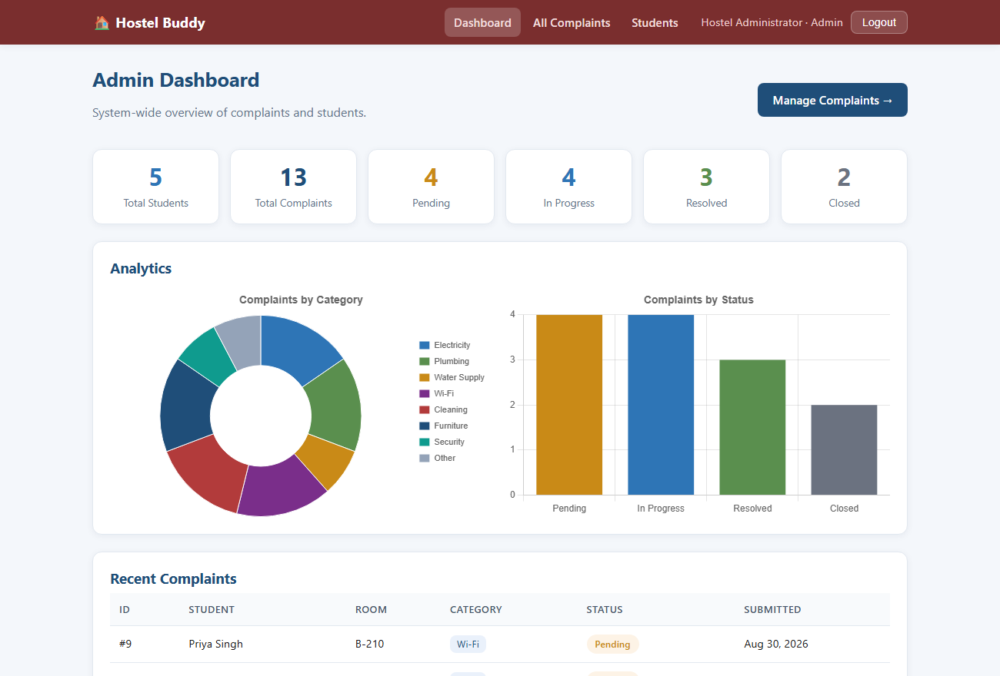
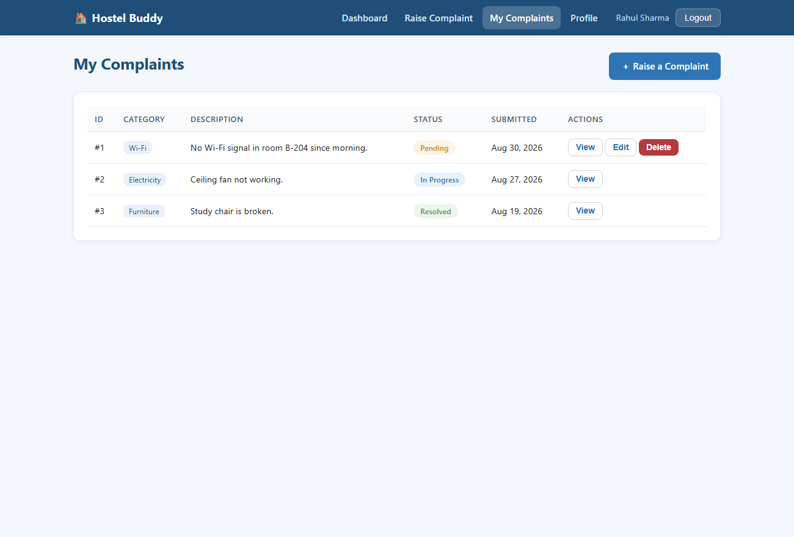
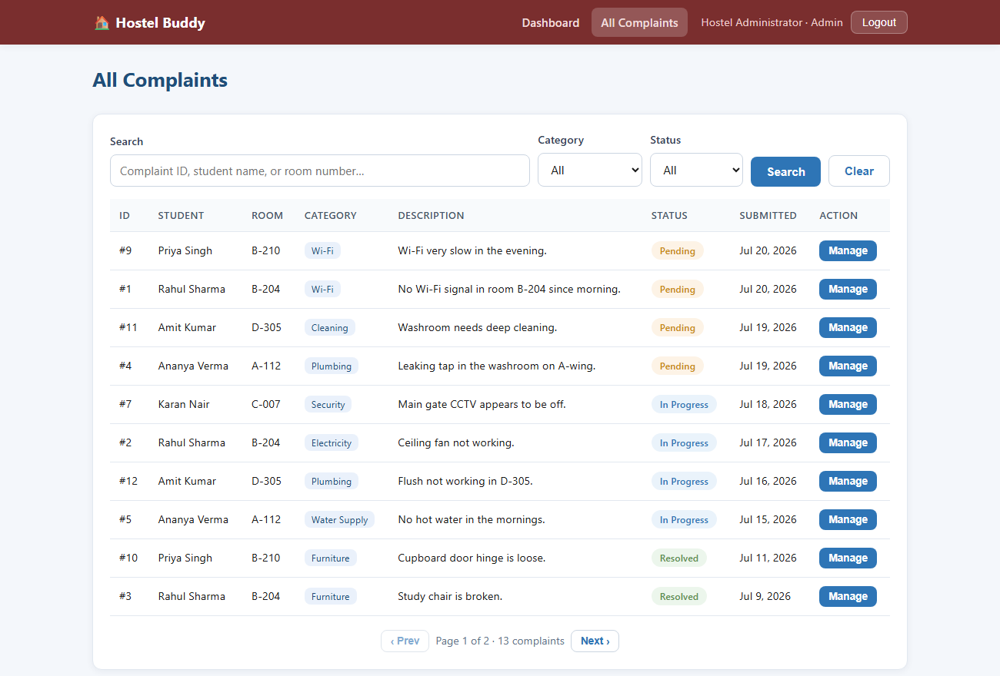
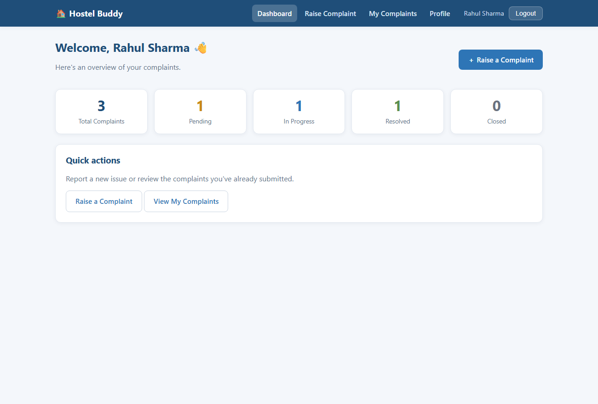
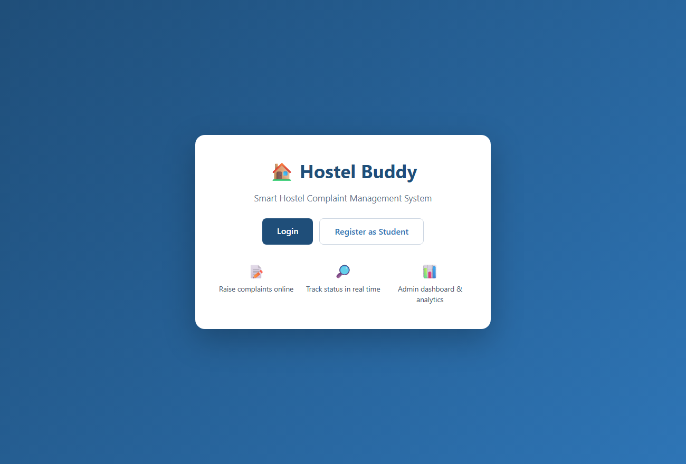
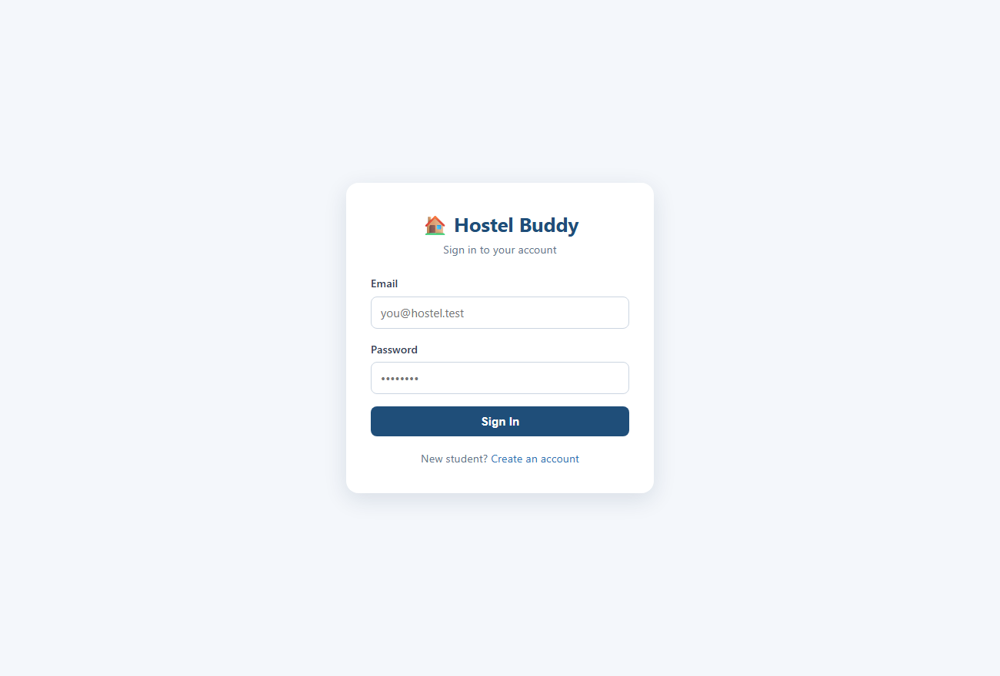
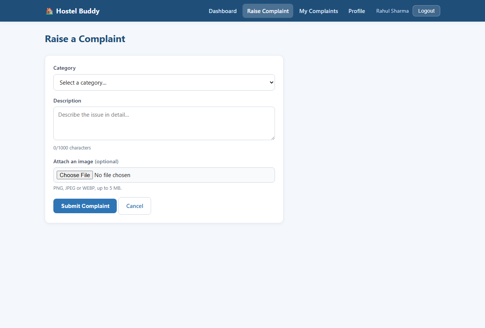

# 🏠 Hostel Buddy

**A Smart Hostel Complaint Management System** — students raise and track maintenance complaints online; administrators manage and resolve them from a dashboard. It replaces the paper complaint register with a searchable, trackable, statistics-driven web app.

> Built as a **model working version**: realistic end-to-end functionality and a clean layered architecture, without the scope of a full production system.

---

## ✨ Features

**Students**
- Register, log in, manage a profile
- Raise a complaint — pick a category, describe the issue, optionally attach a photo
- Track status in real time: **Pending → In Progress → Resolved → Closed**
- View admin remarks and resolution date
- Edit or delete a complaint while it's still Pending
- Personal dashboard with complaint statistics

**Administrator**
- Single dashboard over **all** complaints
- Search & filter by ID, student name, room number, category, or status
- Advance status and add remarks
- Analytics: totals, status breakdown, and category distribution charts
- View registered students

---

## 📸 Screenshots

| Admin Dashboard (analytics) | Student — My Complaints |
|---|---|
|  |  |

| Admin — All Complaints (search/filter) | Student Dashboard |
|---|---|
|  |  |

<details>
<summary>More screenshots (landing, login, raise complaint)</summary>





</details>

---

## 🧱 Tech Stack

| Layer | Technology |
|-------|-----------|
| Frontend | HTML5 · CSS3 · vanilla JS · Chart.js (vendored, no CDN) |
| Backend | Node.js · Express (layered: routes → controllers → services → repositories) |
| Database | Node's built-in `node:sqlite` — no native build step; Postgres-compatible schema |
| Auth | JWT + bcrypt password hashing, role-based access control |
| Security | `helmet` security headers + CSP, rate-limited auth endpoints |
| Uploads | Multer (local `/uploads`, swappable for object storage) |

Why these choices and their trade-offs: **[docs/architecture.md](docs/architecture.md) §9**. The database uses Node's built-in SQLite so teammates can clone and run with **no compiler toolchain** — see decision D5 in [problems_faced_and_bugs_encountered.md](docs/problems_faced_and_bugs_encountered.md).

---

## 🏗️ Architecture at a glance

```
Browser (static pages)  ──JSON/JWT──►  Express API  ──SQL──►  SQLite
  presentation tier                    application tier         data tier
                                   routes → middleware →
                                   controllers → services → repositories
```

The frontend holds no business rules — every rule (validation, authorization, complaint lifecycle) lives on the server. The data-access layer is the only place that touches SQL, so the database can be swapped without changing business logic. Full write-up: **[docs/architecture.md](docs/architecture.md)**.

---

## 📚 Documentation

This project is documented the way real engineering work is — decisions before code, and an honest record of what happened.

| Document | What it shows |
|----------|---------------|
| [requirements.md](docs/requirements.md) | Gathering & defining requirements (FRs, NFRs, acceptance criteria) |
| [architecture.md](docs/architecture.md) | System design before coding (tiers, layers, request flow) |
| [technical_design.md](docs/technical_design.md) | Implementation detail (schema, API contract, auth mechanics) |
| [phasewise_roadmap.md](docs/phasewise_roadmap.md) | Planning & sequencing complex work |
| [performance_review.md](docs/performance_review.md) | Optimization & trade-off analysis |
| [problems_faced_and_bugs_encountered.md](docs/problems_faced_and_bugs_encountered.md) | Debugging, decisions, and lessons learned |

### Formal submissions

| Document | Description |
|----------|-------------|
| [Group19_HostelBuddy_SRS.pdf](Group19_HostelBuddy_SRS.pdf) | **Software Requirements Specification** (IEEE 830) — *what* the system must do: 41 functional requirements, use cases, wireframes |
| [Group_19_Hostel_Buddy_SADD.pdf](Group_19_Hostel_Buddy_SADD.pdf) | **Software Architecture and Design Document** — *how* it is built: architecture, module decomposition, ER/class/sequence/activity/state/deployment diagrams, and full requirement traceability |
| [Group_19_Hostel_Buddy_Architecture_Review.pdf](Group_19_Hostel_Buddy_Architecture_Review.pdf) | **Architecture Review Presentation** — 16 slides (16:9) covering requirements, architecture, modules, data flow, lifecycle, database, security and OOAD diagrams |

Editable sources for both are in [docs/srs-source/](docs/srs-source/) and [docs/sadd-source/](docs/sadd-source/).

---

## 🚀 Getting Started

> Prerequisites: **Node.js 22.5+** (for the built-in `node:sqlite` module). No compiler or build tools needed.

```bash
# 1. Install dependencies
npm install

# 2. Configure environment
cp .env.example .env      # then edit values (JWT secret, admin credentials)

# 3. (Optional) Seed sample students + complaints for a ready-made demo
npm run seed

# 4. Start the server
npm start

# App: http://localhost:4000
```

The admin account is seeded from `ADMIN_EMAIL` / `ADMIN_PASSWORD` in `.env` on first run. Students self-register from the app.

### Demo logins (after `npm run seed`)

| Role | Email | Password |
|------|-------|----------|
| Administrator | `admin@hostel.test` | `admin123` |
| Student | `rahul@hostel.test` (and `ananya`, `karan`, `priya`, `amit`) | `student123` |

### Testing

```bash
npm start          # in one terminal
npm test           # in another — 103 API integration checks (auth, complaints, admin, dashboard)
```

### Environment variables

| Variable | Purpose |
|----------|---------|
| `PORT` | Server port (default 4000) |
| `NODE_ENV` | `development` or `production` (production blocks insecure defaults) |
| `JWT_SECRET` | Secret for signing auth tokens |
| `ADMIN_NAME` / `ADMIN_EMAIL` / `ADMIN_PASSWORD` | Seeded administrator account |
| `DB_PATH` | SQLite database file location |
| `UPLOAD_DIR` | Where complaint images are stored |

---

## 🗺️ Complaint Lifecycle

```
Student submits          Admin works it                Done
    │                        │                          │
 Pending  ──────►  In Progress  ──────►  Resolved  ──────►  Closed
                                         (resolved_at set)
```

The student is read-only on status; the admin drives every transition.

---

## 📁 Project Structure

```
Hostel Buddy/
├── README.md
├── docs/                 # requirements, architecture, design, roadmap, reviews, screenshots
├── src/
│   ├── config/           # env, constants
│   ├── middleware/       # auth, upload, errorHandler, requestLogger, security
│   ├── modules/          # auth · users · complaints · dashboard (routes/controller/service/repo)
│   ├── db/               # connection, schema.sql, seed, seedAdmin
│   ├── utils/            # jwt, validators
│   ├── app.js            # wires middleware + routes
│   └── server.js         # entry point
├── public/               # frontend: pages + css/ + js/ + vendor/ (Chart.js)
├── tests/                # API integration tests (auth, complaints, admin, dashboard)
├── data/                 # SQLite database (git-ignored)
└── uploads/              # complaint images (git-ignored)
```

---

## 🎥 Demo

Screenshots are in [`docs/screenshots/`](docs/screenshots/) and above. *A short walkthrough video of the full student → admin workflow will be linked here.*

---

## 🔭 Roadmap / Future Enhancements

Email & push notifications · maintenance-staff role · complaint ratings · QR-code room identification · native mobile app · AI-based categorization · multi-hostel support. Scope is deliberately frozen for v1 — see [requirements.md](docs/requirements.md) §8.
